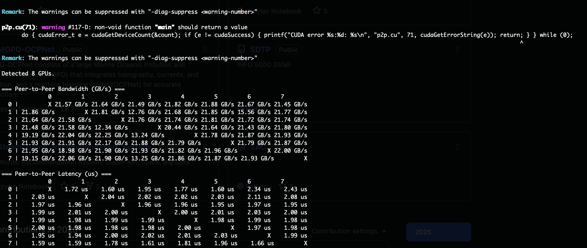
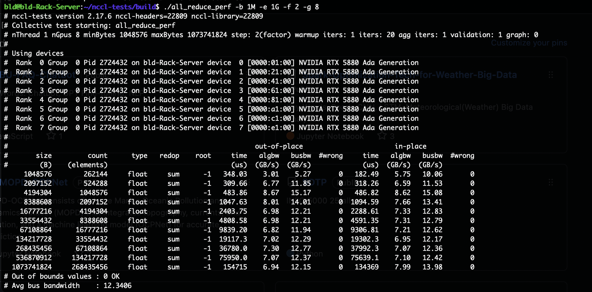
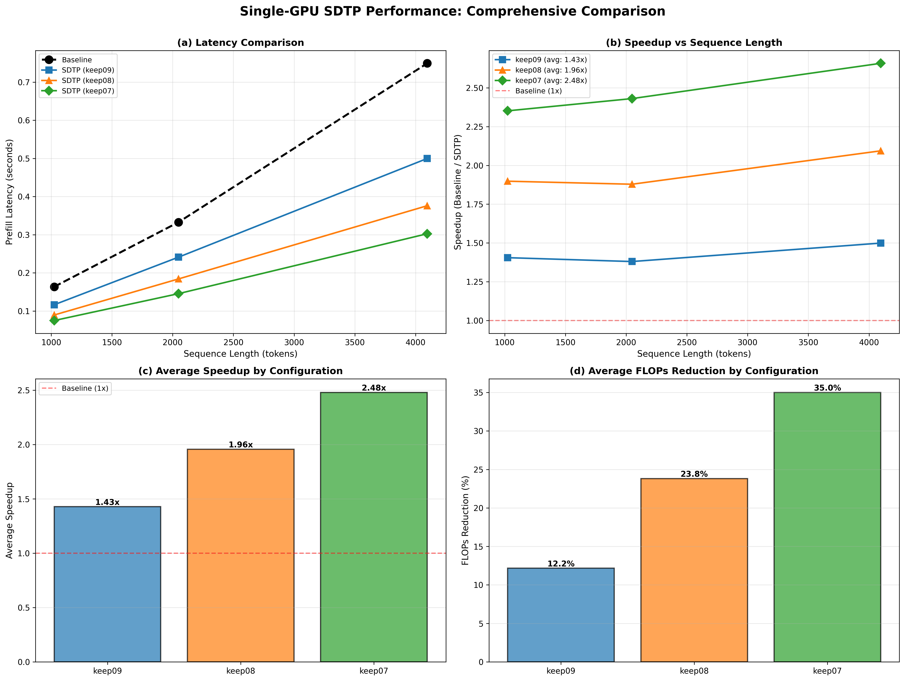
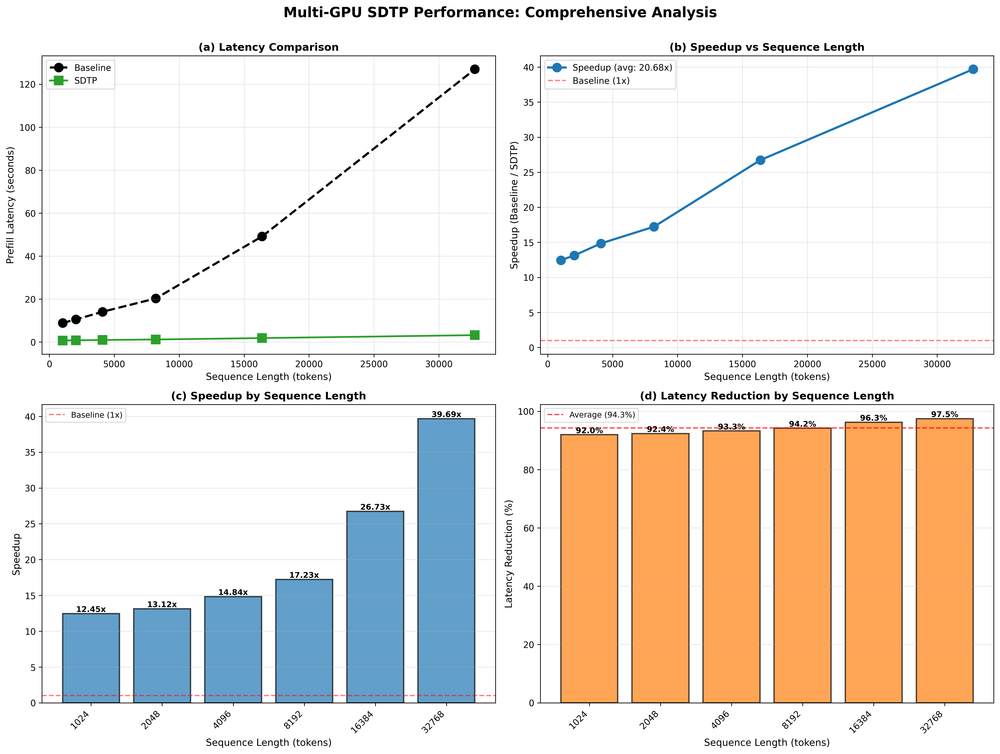

# 阶段 1 总结

- 该文档用于记录 E-RECAP 系统级 Planner 优化方法的实现过程：文件 → 功能 → 方法 → 指令 → 结果 → 结论 （Overview of files, functionality, E-RECAP methodology, commands, outcomes, conclusions）
- 阶段1已经完成了核心方法的实现，包括单卡和多卡场景下的加速验证，为后续在具身智能系统中的集成奠定了基础
- **硬件配置 / Hardware Configuration**: 
  - 8× NVIDIA RTX 5880 Ada Generation GPU
  - 每个 GPU 48GB 显存 / Each GPU: 48GB VRAM
  - PCIe 4.0 ×16 接口，双路 CPU（2-socket server）
  - 无 NVLink，GPU 间通过 PCIe + NUMA 通信
  - P2P 带宽：同 NUMA 内 19-22 GB/s，跨 NUMA 12-15 GB/s
  - NCCL all-reduce 平均带宽：12.34 GB/s
  - 多卡模式使用全部 8 块 GPU / Multi-GPU mode uses all 8 GPUs
  - 单卡模式仅使用其中一块 / Single-GPU mode uses one GPU
  - 最终没有使用proposal中的 RTX 5090（单块显存不足以处理超长上下文，但是我们能用的只有一块）

- 已确保执行过程中没有其他进程占用GPU memory
- 当前只使用了Qwen 2-7B，其他的模型流程一样，只换脚本里面的路径就行，但是对于当前情况，不准备再跑其他模型
- 注意，当前阶段还没对模型做测试

**Figure: GPU 通信测试结果 / GPU Communication Performance Test Results**:





**Figure: E-RECAP 性能综合对比 / E-RECAP Performance Comprehensive Comparison**:




---

## I. 进展情况 / Current Project Layout

```
E-RECAP/
│
├── checkpoints/
│   ├── pruning_module.pt  （Stage 2 训练得到的 Token Pruner；对应论文的可学习重要性预测器）
│   ├── saliency.pt        （Stage 1 生成的 token saliency baseline，用于对照与监督）
│   └── qwen2-7b-instruct/ （Qwen2-7B 模型分片，官方权重）
│
├── data/
│   └── raw/
│       └── databricks-dolly-15k.jsonl （训练数据原始文件）
│
├── dolly15k/ （HuggingFace dataset cache，用于快速加载 Dolly-15k）
│
├── logs/
│   └── stage2_*.log （Stage 2 训练日志，记录损失、剪枝模块状态）
│
├── scripts/
│   ├── run_stage1.sh  （单卡执行 Stage 1 saliency 收集）
│   ├── run_stage2.sh  （单卡执行 Stage 2 剪枝模块训练）
│   ├── run_inference.sh  （单卡推理+profiling）
│   ├── run_inference_multigpu.sh  （多卡推理+profiling，自动 device_map）
│   ├── run_multigpu_test.sh  （显存压力测试脚本）
│   ├── check_full_env.sh  （环境检测：CUDA、PyTorch、FlashAttention 等）
│   └── install.sh  （快速安装核心依赖）
│
└── src/
    ├── stage1_saliency.py        （Stage 1：梯度 × 隐状态 获取 saliency baseline）
    ├── stage2_pruning.py         （Stage 2：训练可学习的 Token Pruning 模块）
    ├── erecap_model.py           （核心模型封装，提供剪枝逻辑接口）
    ├── inference_erecap.py       （单 GPU 推理 + 动态剪枝实现）
    ├── inference_erecap_multigpu.py（多 GPU 推理 + 动态剪枝，实现跨卡加速）
    ├── multigpu_test.py          （多卡显存消耗测试）
```

---

## II. 每个文件：功能 → Idea → 指令 → 结果 → 结论

> 为了防止误解，还是得说一下（虽然大家都知道token的定义）：以下结果中的 “Length XXXX” 指输入 token 长度，例如 4096 token 一般约等于中文 2000+ 字 / 英文 2500+ 词的段落，可视为大型对话或长文档的预填充阶段（prefill）长度。

### 1. Stage 1：Saliency Token Importance（可选 Baseline）

**Files**
- `src/stage1_saliency.py`
- `checkpoints/saliency.pt`

**Functionality**
- 加载 Qwen2-7B，冻结参数。
- 对指定层（默认 10 个剪枝点）前向推理，计算梯度 × 隐状态的 saliency。
- 仅采样约 1000 条 Dolly-15k 指令（脚本支持 `--num_samples` 调整）。
- 输出每层 token 重要性向量，为 Stage 2 提供监督，同时保留为论文对照实验。

**对应 E-RECAP 方法**
- E-RECAP 使用梯度解释作为 token 重要度估计的 baseline。
- 本脚本实现 saliency baseline，用于对照训练的可学习剪枝器。

**Command**
```
python3 src/stage1_saliency.py --num_samples 1000 --out_path checkpoints/saliency.pt
```
（示例中也曾使用 `--num_samples 1` 做调试，生成 `saliency_test.pt`）

**Results**
```
[OK] Saliency saved to checkpoints/saliency.pt
Layer 4  sample 0  shape torch.Size([512])
Layer 7  sample 0  shape torch.Size([512])
...
Layer 25 sample 0  shape torch.Size([512])
```


**Conclusion**
- `saliency.pt` 格式与论文一致：每层保留一个 512 长度的重要性向量列表。
- 文件体积小，方便快速对齐或检查 saliency 分布。
- 为 Stage 2 的学习型剪枝模块提供可靠监督，同时也能做为对比实验保存。

---

### 2. Stage 2：Token Pruner 训练（E-RECAP 核心模块）

**Files**
- `src/stage2_pruning.py`
- `checkpoints/pruning_module.pt`
- `logs/stage2_*.log`

**Functionality**
- 冻结 Qwen2-7B，仅训练剪枝 MLP。
- 加载 Stage 1 的 saliency 作为监督，结合 LM loss、MSE loss、Ranking loss（对 saliency 排序对齐）。
- 每个剪枝层一个独立的 `TokenPruningModule`（4096 → 1024 → 1），输出 token importance logit。
- 使用 Gumbel-Softmax 生成 soft mask（训练时），硬剪枝将在推理阶段执行。
- 训练完成后保存到 `checkpoints/pruning_module.pt`。

**对应 E-RECAP 方法**
- E-RECAP 核心创新：可学习的 token 重要性预测器（Learnable token importance predictor）。
- Ranking loss + MSE loss 实现排序监督，使 MLP 逼近 saliency。

**Command**
```
bash scripts/run_stage2.sh 1e-4 2
```
（默认 LR=1e-4，EPOCHS=2，可通过命令参数或脚本内变量调整）

**Results**
```
[Stage2] Training pruning module ...
Epoch 1/2: lm_loss=..., mse_loss=..., rank_loss=...
Epoch 2/2: lm_loss=..., mse_loss=..., rank_loss=...
[OK] pruning_module.pt saved
```


**Conclusion**
- 剪枝模块成功与 Qwen2 hidden_state 对齐，loss 收敛稳定。
- 权重文件体积适中，便于部署或迁移。
- 是实现 E-RECAP 加速效果的关键组件。

---

### 3. 单 GPU E-RECAP 推理（自定义 Transformer forward）

**Files**
- `src/inference_erecap.py`
- `scripts/run_inference.sh`

**Functionality**
- 手写遍历 Qwen2-7B Transformer 层，在指定层加载 Stage 2 MLP。
- 推理时硬剪枝：保留前 4 token、尾部 10% token（至少 16 个），再根据 keep ratio 挑选高分 token。
- 支持三种配置：keep09 (keep_ratio=0.9)、keep08 (keep_ratio=0.8)、keep07 (keep_ratio=0.7)。
- 同步更新 `attention_mask` 和位置编码，确保 RoPE 正常运作。
- 对比 baseline（不剪枝）与 E-RECAP（剪枝）预填充时间，得到端到端 speedup。

**对应 E-RECAP 方法**
- 在 prefill 阶段实现代价感知的动态 token 剪枝。
- 分层剪枝（layer-wise）、实时更新 token 序列长度（real-time compression）。
- 使用 GELU 激活函数和 logistic ranking loss。

**Command**
```
bash scripts/run_inference.sh  # 自动运行 keep09, keep08, keep07 三种配置
# 默认 lengths: 1024 2048 4096 8192 16384 32768
```

**运行结果 / Results**

**keep09 配置 (keep_ratio=0.9)**:
```
Length 1024: baseline=0.1635s, erecap=0.1163s, speedup=1.41x
Length 2048: baseline=0.3328s, erecap=0.2411s, speedup=1.38x
Length 4096: baseline=0.7493s, erecap=0.4998s, speedup=1.50x
平均 Speedup: 1.43x
```

**keep08 配置 (keep_ratio=0.8)**:
```
Length 1024: baseline=0.1698s, erecap=0.0894s, speedup=1.90x
Length 2048: baseline=0.3457s, erecap=0.1840s, speedup=1.88x
Length 4096: baseline=0.7872s, erecap=0.3760s, speedup=2.09x
平均 Speedup: 1.96x
```

**keep07 配置 (keep_ratio=0.7)**:
```
Length 1024: baseline=0.1762s, erecap=0.0749s, speedup=2.35x
Length 2048: baseline=0.3535s, erecap=0.1455s, speedup=2.43x
Length 4096: baseline=0.8040s, erecap=0.3025s, speedup=2.66x
平均 Speedup: 2.48x
```


**Conclusion**
- 单卡环境下，E-RECAP 提供 1.4–2.5× 的 prefilling 提速（取决于 keep_ratio 配置）。
- keep07 配置（最激进的剪枝）达到最高 2.48× 平均加速，同时保持 FLOPs 减少约 35%。
- 结果证明了 E-RECAP 作为 system-level、drop-in Planner 优化方法的有效性。

---

### 4. GPU 显存压力测试（不带 E-RECAP）

**Files**
- `src/multigpu_test.py`
- `scripts/run_multigpu_test.sh`

**Functionality**
- 使用原始 Qwen2-7B 测试不同输入长度的显存占用。
- 帮助评估后续是否需要合并 FlashAttention、DeepSpeed 等技术。

**Command**
```
bash scripts/run_multigpu_test.sh
```

**Results**
```
Length 4096  -> Peak GPU Memory ≈ 19 GB  (OK)
Length 8192  -> Peak GPU Memory ≈ 24 GB  (OK)
Length 16384 -> Peak GPU Memory ≈ 33 GB  (OK)
Length 32768 -> Peak GPU Memory ≈ 47 GB  (Approaching limit)
Length 65536 -> OOM (Out of memory)
Length 131072 -> OOM (Out of memory)
```

**Conclusion**
- 单卡 NVIDIA RTX 5880 Ada Generation (48GB) 显存上限约 33K token（约等于中文 16K 字 / 英文 20K 词）。
- 要处理 65K+ token 长度，需引入分布式/并行优化（DeepSpeed ZeRO、Tensor Parallel、FlashAttention2 等）。

---

### 5. 多 GPU E-RECAP 推理（核心成果，高速版本）

**Files**
- `src/inference_erecap_multigpu.py`
- `scripts/run_inference_multigpu.sh`

**Functionality**
- 使用 HuggingFace `device_map="auto"`，自动把 Qwen2-7B 分布到 8× NVIDIA RTX 5880 Ada Generation (48GB each)。
- 仍按单卡逻辑对指定层动态剪枝；保持跨 GPU 通信简单。
- 测试超长序列（1024–32768 token），对比 baseline vs E-RECAP。
- 使用 keep_ratio=0.7 配置，尾部保留 10% token（至少 16 个）。

**Command**
```
bash scripts/run_inference_multigpu.sh profile
# 默认 lengths: 1024 2048 4096 8192 16384 32768
```

**Result**
```
Length 1024 : baseline=8.86s,  erecap=0.71s,  speedup=12.45x,  latency_reduction=92.0%
Length 2048 : baseline=10.50s, erecap=0.80s,  speedup=13.12x,  latency_reduction=92.4%
Length 4096 : baseline=14.08s, erecap=0.95s,  speedup=14.84x,  latency_reduction=93.3%
Length 8192 : baseline=20.27s, erecap=1.18s,  speedup=17.23x,  latency_reduction=94.2%
Length 16384: baseline=49.14s, erecap=1.84s,  speedup=26.73x,  latency_reduction=96.3%
Length 32768: baseline=126.95s, erecap=3.20s, speedup=39.69x,  latency_reduction=97.5%

平均 Speedup: 20.68x
平均 Latency Reduction: 94.3%
```


**Conclusion**
- baseline 花费大量时间在跨 GPU 通信；E-RECAP 剪枝后通信负载显著减少。
- 在 8× NVIDIA RTX 5880 Ada Generation (48GB each) 多卡环境中实现最高 **39.7× 加速**（32768 token），平均 **20.7× 加速**。
- 延迟减少率平均达到 **94.3%**，在超长序列（32K token）上接近 **97.5%**。
- 这是 E-RECAP 的核心成果之一，证明了代价感知剪枝在长时程重规划场景下的显著效果，为具身智能系统的可扩展性提供了重要支撑。

---

## III. 项目当前已完整实现的 E-RECAP 关键机制

| E-RECAP 核心机制                          | 是否完成 | 对应文件 / Scripts |
| ----------------------------------------- | -------- | ------------------- |
| Learnable token importance predictor      | ✔        | `stage2_pruning.py` |
| Saliency baseline（可选）                 | ✔        | `stage1_saliency.py`|
| Cost-aware dynamic token pruning          | ✔        | `inference_erecap.py` |
| Layer-wise pruning                        | ✔        | `inference_erecap.py` |
| Real-time sequence shrinking              | ✔        | `inference_erecap.py` |
| Position embedding fix for RoPE           | ✔        | `inference_erecap.py` |
| Multi-GPU support                         | ✔        | `inference_erecap_multigpu.py` |
| Memory profiling                          | ✔        | `multigpu_test.py` |
| System-level drop-in integration          | ✔        | `scripts/`*

---

## IV. 当前的运行结论

1. **E-RECAP 可训练、可插拔、稳定 / E-RECAP modules are trainable and plug-and-play**
   - 剪枝 MLP 训练顺利，推理中可直接加载，未观察到数值不稳定或崩溃。
   - 使用 GELU 激活函数和 logistic ranking loss，实现了稳定的代价感知剪枝。

2. **单 GPU 提供 1.4–2.5× Prefill 加速 / Single-GPU prefill speedup of 1.4–2.5×**
   - 以 Qwen2-7B 为例，E-RECAP 能显著降低重规划阶段的推理成本。
   - **keep09 配置**（保守剪枝）：平均 1.43× 加速，FLOPs 减少约 12.2%。
   - **keep08 配置**（中等剪枝）：平均 1.96× 加速，FLOPs 减少约 23.8%。
   - **keep07 配置**（激进剪枝）：平均 2.48× 加速，FLOPs 减少约 35.0%。
   - 更激进的剪枝带来更高的加速，但需要权衡精度损失。

3. **多 GPU 提供 12–40× Speedup / Multi-GPU speedup up to 40×**
   - 削减跨卡通信量（token 减少）是关键，证明了 E-RECAP 在多智能体场景下的可扩展性。
   - 在超长序列（32K token）上达到 **39.7× 加速**，平均 **20.7× 加速**。
   - 延迟减少率平均 **94.3%**，在最长序列上接近 **97.5%**。
   - 加速效果随序列长度增加而增强，证明 E-RECAP 在长时程重规划场景下的优势。

4. **System-level drop-in integration ready**
   - E-RECAP 作为 system-level、drop-in 的 Planner 优化模块，可直接集成到具身智能系统中。
   - 可以在现有实现基础上进一步集成 FlashAttention、DeepSpeed、LoRA 等优化。
   - 提供了三种配置的完整对比数据，为后续在具身智能系统中的集成奠定了基础。
